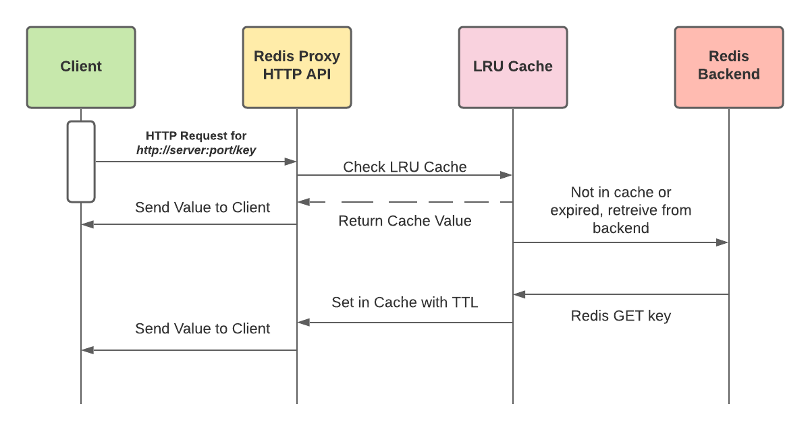

# redis-proxy

## Design

The goal of this project is to provide an HTTP API interface for GET requests to a Redis backend with a caching layer leveraging an LRU cache.

* HTTP requests to `/key` are converted into Redis `GET key` requests.
* An LRU Cache stores Redis key/values in memory for the proxy and has a configurable cache expiry and size parameters available.
* If the LRU Cache lacks the `key` requested, we will reach to the Redis backend and upon retrieving the key/value, we set place this in the Cache



## Build, Test and Run

1. Download [redis-proxy.tar.gz](https://github.com/dontrebootme/redis-proxy)
2. `tar -zxvf redis-proxy.tar.gz`
3. `cd redis-proxy`
4. `make test`

## Code structure

* `main.go`
  * Proxy type has methods GetCache(), GetRedis() and ServeHTTP()
  * GetCache() handles retrieving valid cache items
  * GetRedis() is for the occasions we need to pull from Redis (not in cache or expired)
  * ServeHTTP() is how we handle HTTP requests to the Proxy/API
* `main_test.go`
  * TestUnitProxy_RedisGet() - Test RedisGet(), valid keys, invalid clients, etc
  * TestUnitProxy_CacheGet() - Test CacheGet(), uninitialized cache, cache miss for valid, cache miss for invalid, etc
  * TestEndtoEnd_Proxy() - Honestly... not sure the best way to do this, but was my attempt at showing cache and backend behavior via HTTP requests. This tests many items from loading 1200 items into Redis backend, ensure cache miss, retrieve from redis, cache hit, cache expiry/ttl, cache size/eviction, etc.

## Time allocation

* Understand existing Segment Go libraries - 1 hour
* HTTP API - 1 hour
* LRU Cache - 1 hour
* Redis - 30 minutes
* Unit Tests - 2 hours
* End to End testing - 2 hours

## Arguments

```shell
$ redis-proxy

Usage:
  redis-proxy [-h] [-help] [options...]

Options:
  -backing-redis string
        Address of the backing Redis (host:port) (default redis:6379)

  -cache-size int64
        Capacity (number of keys) (default 5000)

  -cache-time int64
        Cache expiry time (seconds) (default 120)

  -port string
        TCP/IP port number the proxy listens on (default "8080")
```

## TODO Requirements

Concurrency has some level of completeness. More time could be spent on Redis pool size, ServeHTTP has some concurrency built it, but other items could further impove the parallel concurrent processing issues that could arise.
Redis client protocol - some research was done into `cmux` and other options, but this was not attempted further.
End to End testing - This probably needs to be completely redone, it doesnt feel right, and I'd probably break it out from `go test` and simplify.
Cache algorithm complexity - a deeper dive into the ccache library should be performed to understand complexity of various cache operations
